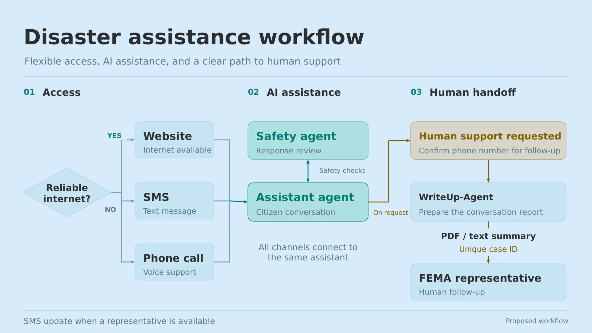

# ReliefRN

**An AI front door for disaster assistance.** After a hurricane, flood or wildfire, ReliefRN helps people find what help exists near them, check for scams, and reach a human, in their own language, over whatever connection they have.

It is built on three **Microsoft Foundry agents** that work together: one answers, one checks every risky situation for safety, and one writes up the case for a human caseworker.

> Built for the **Disaster Assistance Navigator** hackathon challenge. ReliefRN is an independent prototype. It is not FEMA or any government agency, it never submits applications, and it never claims to have transferred anyone to a human.

---

## How it works

```text
Citizen (SMS / Web / Voice)
             |
             v
     Assistance Agent <---- Official resources
             |
             +---- Safety Agent (when needed)
             |
             v
     Clear guidance + next steps
             |
             v
     Optional report + user consent
             |
             v
       WriteUp Agent
             |
             v
     Report saved for human review
```

Demo: reports are saved locally; forwarding and callbacks are simulated.



**1. Access.** People reach ReliefRN through whichever channel works for them. With reliable internet that is the website; without it, SMS or a phone call. Every channel talks to the same assistant.

**2. AI assistance.** The **Assistance agent** answers using live FEMA and National Weather Service data. The **Safety agent** reviews anything involving scams, danger, money or disputes before the answer goes out, and decides whether a human is needed.

**3. Human handoff.** When someone asks for a person, the **WriteUp-Agent** turns the conversation into a short case summary with a reference ID. The person can review, edit, download or print it and share it with a caseworker, so they never have to start over.

### What is built today, and what is proposed

| Step | Status |
|---|---|
| Website with live agents | **Working.** See [`ReliefRN_website`](ReliefRN_website) |
| SMS-style conversation | **Working as a local demo.** A phone-style messaging site; no real texts are sent. See [`reliefrn-phone-demo`](reliefrn-phone-demo) |
| Phone call (voice) | **Working as a browser demo.** Simulated call UI with live Microsoft Voice Live audio and nine languages. See [VOICE.md](reliefrn-phone-demo/VOICE.md). Real telephony and voice report consent are not implemented |
| Safety agent review | **Working** on the website and in the SMS demo |
| WriteUp-Agent summary with case ID | **Working.** Website: editable summary with an `RRN-…` reference, download and print. SMS demo: numbered report files saved locally |
| Callback from a FEMA representative | **Simulated.** Nothing is forwarded to FEMA; the apps say so explicitly |
| SMS update when a representative is free | **Proposed** |

---

## What's in this repository

| Folder | What it is | Run it |
|---|---|---|
| [`ReliefRN_website/`](ReliefRN_website) | The main website: live AI chat, map of nearby help, 10 languages, accessibility tools | [RUN-LOCALLY.md](ReliefRN_website/RUN-LOCALLY.md) |
| [`ReliefRN_website/agent-bridge/`](ReliefRN_website/agent-bridge) | Small local Python service that holds the Azure sign-in and connects the website to the three Foundry agents | Started automatically by the website launcher |
| [`reliefrn-phone-demo/`](reliefrn-phone-demo) | Phone-style SMS demo with a consent-gated callback report | [README](reliefrn-phone-demo/README.md) |
| [`test-python-site/`](test-python-site) | Terminal demo of the three agents in web, SMS or voice style | `python reliefrn_demo.py` |
| [`AGENTS.md`](AGENTS.md) | Full instructions for the three Foundry agents | Paste into Foundry |
| [`VOICE-WEB-CONSENT.md`](VOICE-WEB-CONSENT.md) | Proposed consent workflow for voice and web reports | Plan only |

---

## The website

### Talking to the agents
- **Live Foundry agents.** The chat calls `Assistance-agent`, `Safety-EscalationAgent` and `WriteUp-agent` by name through the agent bridge. Each reply shows a **Handled by** line naming the agents and tools that actually ran.
- **Safety first.** Messages about scams, payment requests, danger, legal or medical issues go to the Safety agent before the answer. Clear emergencies ("can't breathe", "trapped", "house on fire") get 911 guidance instantly, in all 10 languages, without waiting for AI.
- **Human handoff.** "Talk to a person" asks the WriteUp-Agent for a summary the person can review, edit, download or print.
- **It still works without AI.** If the agents can't be reached, the site says so and answers from built-in guidance instead of pretending.

### Finding help nearby
- **Location from the conversation.** Say "we're in Houston, TX", a ZIP code or "Buncombe County, NC", and the map, resources and agents all move there. Ambiguous names like "Norfolk" (Virginia or Nebraska?) are never guessed.
- **Nationwide resources, all from public data:**
  - hospitals, fire, EMS and police from the **USGS National Map**;
  - **FEMA Disaster Recovery Centers** and open disaster shelters;
  - year-round shelters and vets from **OpenStreetMap**;
  - live **National Weather Service** alerts and recent **OpenFEMA** declarations for the state.
- **The list matches the chat.** When the assistant names a shelter or clinic with a street address, the site checks the address is real and adds it to the list and map, labelled "Named by your assistant · call to confirm".
- **Virginia extras:** evacuation zone maps and local emergency managers from VDEM.

### For everyone
- **10 languages**, with the picker shown first on every visit. They are ordered by how often each is spoken at home in Virginia: English, Spanish, Chinese, Vietnamese, Arabic, Korean, Urdu, Amharic, French, then Hindi.
- **Arabic and Urdu read right to left**, with the whole layout mirrored.
- **Accessibility:** read-aloud, voice input with a live "listening" indicator, larger text, higher contrast, reduced motion, keyboard navigation, and a list equivalent of the map.
- **Low connectivity:** low-data mode drops the map, and a downloadable offline guide works with no signal.
- **Privacy:**
  - It never asks for Social Security numbers, bank details or ID documents.
  - Chats stay in the browser tab, and each agent conversation is deleted afterwards.
  - It warns about disaster fraud and links to FEMA's fraud-reporting page.

---

## The agents

| Agent | Role | Version |
|---|---|---|
| `Assistance-agent` | Answers people in their language, using OpenFEMA and NWS data and web search for official shelter information | 43 |
| `Safety-EscalationAgent` | Classifies each risky message as allow / caution / escalate / emergency, and recommends a human route | 11 |
| `WriteUp-agent` | Writes the short case record for a human reviewer | 9 |

They run in the Foundry project **ReliefRN** (`disaster-ai-agent.services.ai.azure.com`). Their instructions are kept in [AGENTS.md](AGENTS.md); review notes on them are in [FINDINGS-REVIEW.md](reliefrn-phone-demo/FINDINGS-REVIEW.md).

---

## Quick start: the website

You need **Python 3.10+** and **Node.js 22.13+**.

```bash
git clone https://github.com/wee5h/ReliefRN.git
cd ReliefRN/ReliefRN_website
```

- **Windows:** double-click `start-demo.cmd`
- **macOS / Linux:** run `./start-demo.sh`

Sign in with an account that has the **Azure AI User** role on the ReliefRN Foundry project, then open **http://localhost:5173**. Judges use a service principal instead of their own account. That setup is explained in [RUN-LOCALLY.md](ReliefRN_website/RUN-LOCALLY.md).

---

## Honest limitations

- This is a **prototype**. Callbacks and forwarding to FEMA are simulated, and a generated reference is not a FEMA case.
- **Resource listings** are nearest-by-distance and not confirmed open. Every card says to confirm before travelling.
- The **seven newer translations** were written for this prototype and should be reviewed by native speakers.
- **Voice input** depends on the browser. It works in Chrome and Edge, not Firefox or Brave.
- **A real phone line and real SMS** are designed but not connected yet.

## Team

[@wee5h](https://github.com/wee5h) · [@SM-Code444](https://github.com/SM-Code444) · [@berzi05](https://github.com/berzi05)
